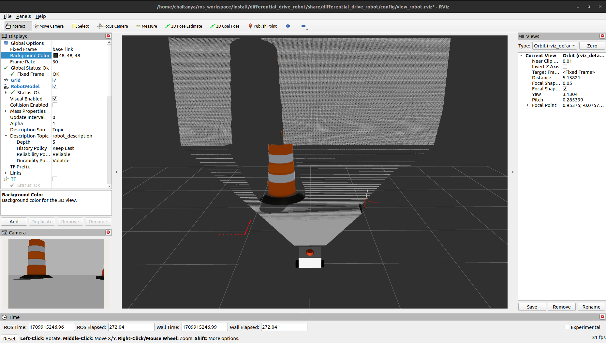
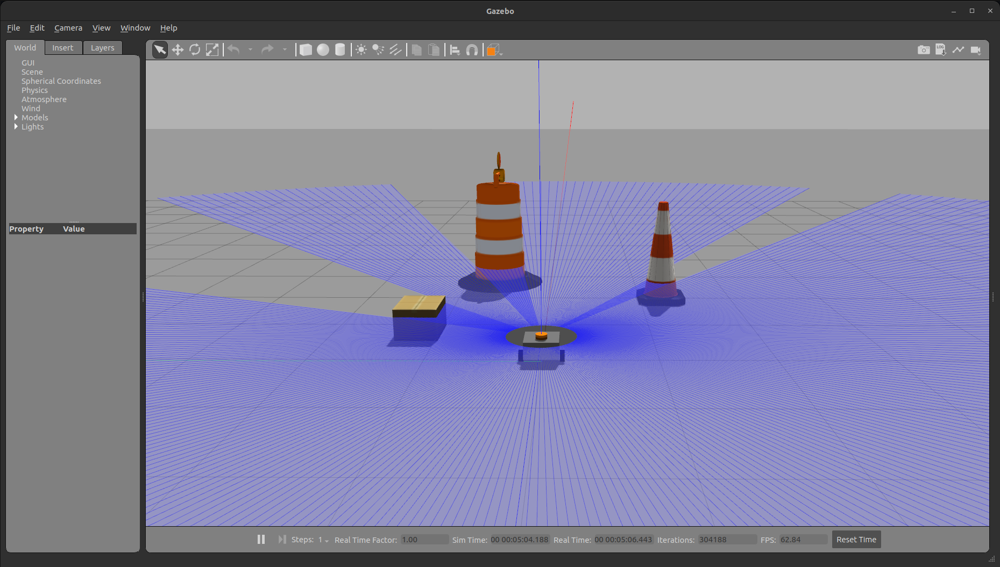
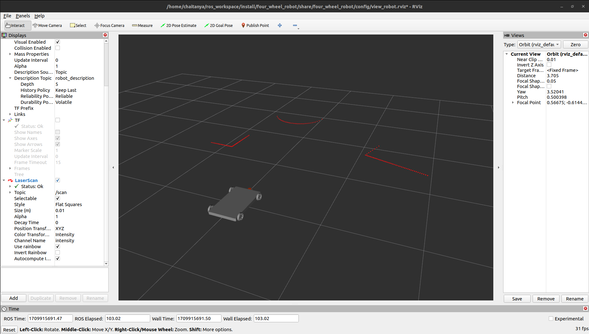
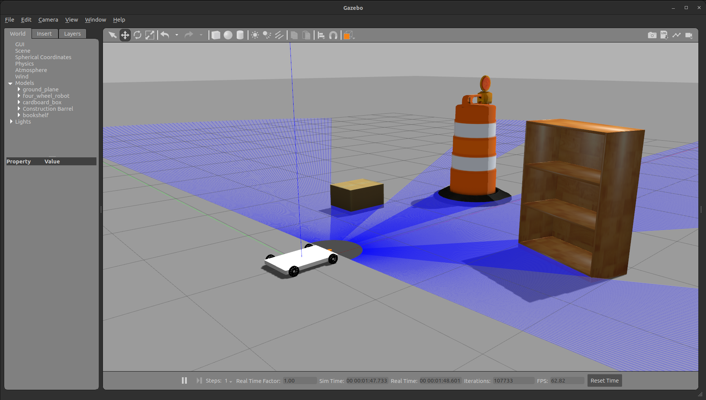
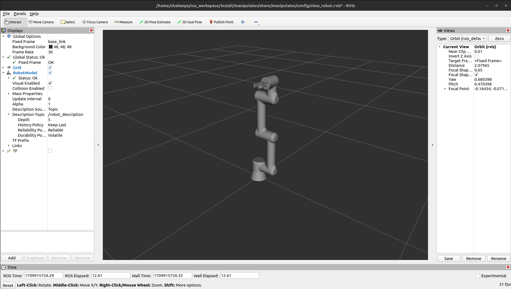
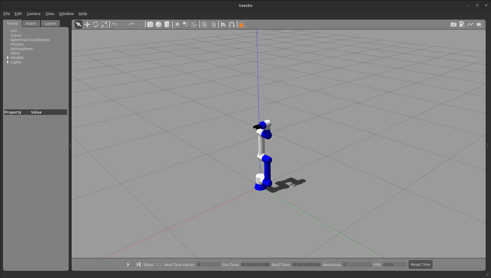
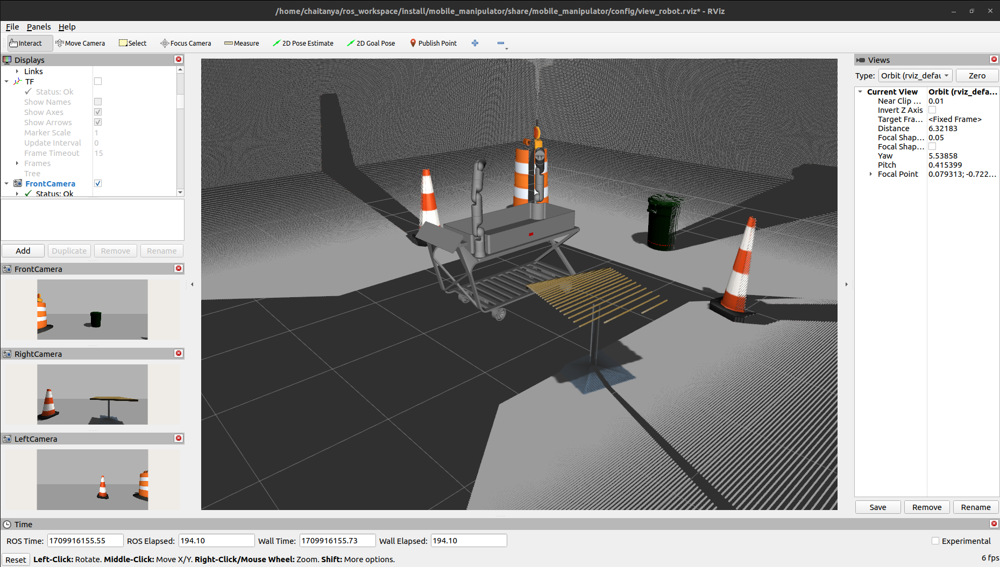
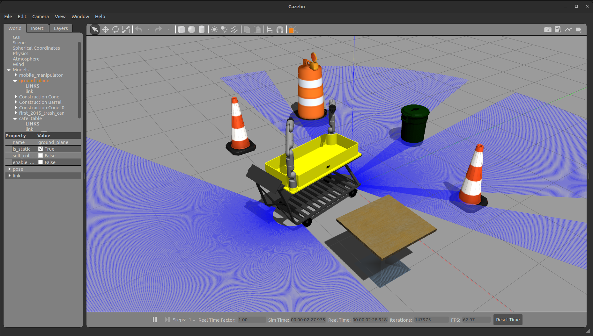

This repository is a collection of Universal Robot Description Format (URDF) files, of various robots I've designed while learning Robot Operating System (ROS).
## Getting Started

### Cloning the Repository

To get started with the robots in this repository to your src
```
git clone https://github.com/Chaitanya-Gumudala-1710/Robots.git
```
### Building the Package
Open a terminal and build the package
```
colcon build
```

### Source the package
```
source install/localsetup.bash
```
## Differential Drive Robot
To see the simulation of the differential drive robot in gazebo and rviz
```
ros2 launch differential_drive_robot differential_robot_simulation.launch.py 
```



## Four wheel Drive Robot
To see the simulation of the four wheel robot in gazebo and rviz
```
ros2 launch four_wheel_robot four_wheel_robot_simulation.launch.py 
```



## Arm
To see the simulation of the arm in gazebo and rviz
```
ros2 launch manipulator manipulator_simulation.launch.py 
```



## Mobile manipulator
### Features

- **Dual Arms on a Cart:** The robot features two manipulator arms mounted on a mobile cart, providing versatility in handling various objects during shopping.

- **Autonomous Navigation:** Utilizing advanced navigation algorithms, the robot autonomously moves through the store, avoiding obstacles and optimizing its path for efficient shopping.

- **Object Recognition and Grasping:** Equipped with computer vision capabilities, the robot can recognize and grasp a wide range of items, making it adept at helping users pick and place products.

- **User-Friendly Interface:** Interact with the robot through a user-friendly interface, allowing you to input shopping lists, preferences, and destination points.

To see the simulation of the mobile manipulator  in gazebo and rviz
```
ros2 launch mobile_manipulator mobile_manipulator_simulation.launch.py 
```


